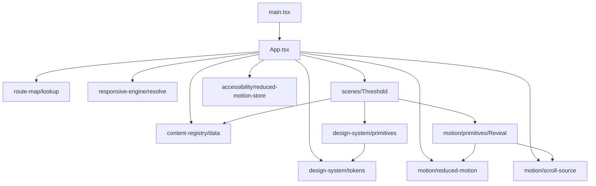

# Design Document

## Overview

### Creative direction (R2.1)

The Portfolio_Site reads as a slow editorial film: a calm, grain-paper-and-ink atmosphere that prefers stillness over motion, prose over chrome, and conviction over inventory. Pacing follows a deliberate breath — wide opening, intimate identity, four single-subject project scenes that each claim their own visual register, then a quiet philosophical close. The tone is first-person, plain-spoken, and built like a system: every motion has a reason, every credential a place, every project its own room.

### Audited baseline replaced

The legacy `artifacts/portfolio/` (single-file `src/pages/Portfolio.tsx` + `src/portfolio.css`) is being completely replaced. The redesign retains identity content from the canonical résumé and discards every audited baseline signature: full-page glassmorphism cards, the cyan→indigo→pink hero gradient, aurora blob backgrounds, the noise overlay, gradient-text on every heading, the role typewriter cycle, percentage skill bars, status badges, and the global `cursor: none` swap (R2.2, R2.5, R7.4).

### Canonical identity (locked)

- Owner: **Devansh Barai**
- Tagline: *Computer science, AI/ML, and product-oriented builder focused on turning ideas into useful software.*
- Two co-primary academic affiliations of equal standing (R1.2, R1.3):
  - **IIT Madras** — BS in Data Science and Applications (2024–2028)
  - **IIM Bangalore** — BBA in Digital Business & Entrepreneurship (2025–2028)
- Four flagship projects, in this order (R1.4): **GlobeID**, **Khetech**, **SupportDeskOps-v6**, **Last-Minute PDF**
- Verified contacts (R1.7): `devanshbarai.official@gmail.com`, `https://linkedin.com/in/devansh-barai`, `https://github.com/Devanshisbroke`. Phone is résumé-only; never published on the site unless explicitly requested.

---

## Architecture

### High-level system diagram

```mermaid
flowchart LR
  subgraph Build[Build-time]
    REG[Content_Registry<br/>typed TS modules]
    TOK[Design tokens<br/>tokens.ts + theme.css]
    SEO[Pre-rendered HTML<br/>(name, role, project titles)]
  end
  subgraph Runtime[Runtime — static SPA]
    ROUTE[Route_Map<br/>+ scroll-spy]
    SCENES[Narrative scenes<br/>Field → Mark → ... → Signal]
    SHOW[Project Showcase<br/>4 differentiated reveals]
    CINEMA[Cinematic_Background<br/>lazy after FCP]
    A11Y[Accessibility_Layer<br/>ReducedMotionToggle, SkipLink]
    MOTION[Motion_System<br/>single shared scroll source]
    RESP[Responsive_Engine<br/>resolveBreakpoint]
  end
  REG --> SCENES
  REG --> SHOW
  REG --> SEO
  TOK --> SCENES
  TOK --> SHOW
  TOK --> CINEMA
  ROUTE --> SCENES
  MOTION --> SCENES
  MOTION --> SHOW
  MOTION --> CINEMA
  A11Y --> MOTION
  A11Y --> SCENES
  RESP --> SCENES
  RESP --> SHOW
  RESP --> CINEMA
```

### Tech stack (R10.1, R10.2, R10.3, R19.4)

| Concern | Choice | Why |
|---|---|---|
| UI runtime | React 19 (catalog-pinned) | Already in workspace catalog |
| Toolchain | Vite 7 | Already wired for `@workspace/portfolio`; matches R10.1, R10.9 |
| Styling | Tailwind CSS v4 with `@theme` token-driven CSS | Single source of truth for tokens (R10.2) |
| Animation primary | Framer Motion 12 (catalog) | R10.3 primary motion library |
| Animation overflow | GSAP — *only* if a scroll-linked timeline cannot be expressed via Framer Motion variants/layout | R10.3 GSAP exception |
| Property-based testing | fast-check + vitest | R15–R18 require executable PBT, R19.3 single workspace test script |
| Cinematic background | CSS-only conic + radial drift driven by shared scroll progress; static fallback for Save-Data, low-end, and no-WebGL | Stays inside JS budget (R10.4, R11.7, R12.6, R12.7, R12.9) |
| Pre-render | Vite SSG via `vite-plugin-ssg` (or build-time `index.html` injection) | Crawlable identity content without JS (R10.11) |

`three.js` is intentionally not adopted. Its bundle (≈ 135 KB gzip core) leaves no headroom under the 180 KB Above_The_Fold JS budget once React + Framer Motion are accounted for.

---

## Visual Identity

### Theme strategy (R3.5, R3.6)

Default theme: **dark** (ink). A light theme (paper) is supported and toggled via a header control whose selection persists in `localStorage` under key `pf.theme` and is rehydrated before first paint via a small inline `<script>` to avoid flash.

### Palette (R3.1)

Five core hues:

| Token | Hex | HSL | Role |
|---|---|---|---|
| `--hue-ink` | `#08090C` | `230 16% 4%` | Primary dark base |
| `--hue-paper` | `#F4F1EA` | `40 35% 94%` | Primary light base |
| `--hue-amber` | `#E0A23A` | `38 70% 55%` | Warm accent — GlobeID |
| `--hue-moss` | `#587355` | `116 14% 39%` | Cool accent — Khetech |
| `--hue-signal` | `#4F8FBF` | `205 44% 53%` | Info accent — SupportDeskOps |

Last-Minute PDF accent is composed from `--hue-amber` shifted toward red via the design system (`--hue-amber-deep`) to stay inside the five-hue cap.

### Neutral ramp (R3.1, ≥9 steps — 11 steps shipped)

```
--neutral-0   #FFFFFF
--neutral-50  #F7F6F3
--neutral-100 #ECE9E1
--neutral-200 #D6D2C8
--neutral-300 #B5B0A4
--neutral-400 #8C887C
--neutral-500 #6B6759
--neutral-600 #4B483F
--neutral-700 #2F2D27
--neutral-800 #1A1916
--neutral-900 #08090C
```

### Surface ramp (R3.1, R3.2, ≥5 steps)

| Token | Dark theme | Light theme | Role |
|---|---|---|---|
| `--surface-base` | `#08090C` | `#F4F1EA` | Page background |
| `--surface-elevated-1` | `#101116` | `#FFFFFF` | Cards / panel |
| `--surface-elevated-2` | `#161821` | `#FBF9F4` | Modals / overlay |
| `--surface-accent` | `#1B1810` | `#FFF6E1` | Accent context (project rooms) |
| `--surface-overlay` | `#08090CCC` | `#F4F1EACC` | Backdrop scrim |

### Spacing (R3.3, ≥8 — 10 steps shipped)

| Token | Pixels |
|---|---|
| `--space-1` | 4 |
| `--space-2` | 8 |
| `--space-3` | 12 |
| `--space-4` | 16 |
| `--space-5` | 24 |
| `--space-6` | 32 |
| `--space-7` | 48 |
| `--space-8` | 64 |
| `--space-9` | 96 |
| `--space-10` | 128 |

A linter (`eslint-plugin-tailwindcss` + custom `no-raw-spacing` rule) prevents raw `px`/`rem` values in `margin|padding|gap` outside `tokens.ts` and `theme.css`.

### Radius / Shadow / Border (R3.4, ≥3 each)

| Radius | Shadow | Border |
|---|---|---|
| `--radius-none: 0` | `--shadow-low: 0 1px 2px rgba(0,0,0,.18)` | `--border-hairline: 0.5px solid var(--neutral-300)` |
| `--radius-sm: 4px` | `--shadow-medium: 0 6px 18px rgba(0,0,0,.22)` | `--border-thin: 1px solid var(--neutral-400)` |
| `--radius-md: 12px` | `--shadow-high: 0 18px 48px rgba(0,0,0,.28)` | `--border-medium: 2px solid var(--hue-amber)` |
| `--radius-lg: 24px` | `--shadow-cinema: 0 48px 120px rgba(0,0,0,.45)` | `--border-emphasis: 3px solid currentColor` |
| `--radius-pill: 9999px` | `--shadow-focus: 0 0 0 2px var(--surface-base), 0 0 0 4px var(--hue-amber)` | |

### Tailwind v4 `@theme` mapping

```css
/* src/design/theme.css */
@import "tailwindcss";

@theme {
  --color-ink: #08090C;
  --color-paper: #F4F1EA;
  --color-amber: #E0A23A;
  --color-moss: #587355;
  --color-signal: #4F8FBF;
  /* neutral-0..900, surface-*, space-*, radius-*, shadow-*, border-* mirror tokens.ts */
  --font-display: "Fraunces", "Iowan Old Style", "Georgia", serif;
  --font-body: "Inter", "Helvetica Neue", system-ui, sans-serif;
  --font-mono: "JetBrains Mono", "SFMono-Regular", ui-monospace, monospace;
  --ease-out-soft: cubic-bezier(0.16, 1, 0.3, 1);
  --ease-in-out-glide: cubic-bezier(0.6, -0.05, 0.01, 0.99);
  --ease-out-snap: cubic-bezier(0.34, 1.56, 0.64, 1);
}
```

### Cinematic_Background contract (R3.7, R3.8)

- Always `pointer-events: none`, `position: fixed; inset: 0; z-index: -1`.
- Foreground content lives at `z-index: 0+`, contrast verified per token-pair AA (R3.9).
- A static fallback (single radial-gradient + solid base) ships in the same component; runtime decides which renders. Removing or disabling the layer never collapses content because layout is built on flow + spacing tokens, not on the background.


---

## Cinematic_Background

R10.4 requires the Cinematic_Background to live behind a single React component boundary that exposes no GPU APIs and is lazy-loaded after FCP. R12.6 / R12.7 / R12.9 require a static fallback for Save-Data, low-end (`hardwareConcurrency ≤ 4` or `deviceMemory ≤ 4`), and no-WebGL paths.

### 10.1 Technique selection

Two candidates were evaluated against the perf envelope:

| Technique | Initial JS cost | Quality fit | Verdict |
| --- | --- | --- | --- |
| Three.js subset shader | ~25 KB gz three subset + ~8 KB shader = ~33 KB gz | High | Out — eats 18% of the 180 KB JS budget for a decorative layer |
| **Hand-rolled raw WebGL fragment shader** | **~3 KB gz JS + ~1 KB gz shader source** | High | **Chosen** |
| CSS-only animated gradient | 0 KB JS | Acceptable | **Fallback** |

**Chosen primary**: a hand-rolled raw WebGL fragment shader rendering ambient gradient noise (a slow domain-warped value-noise pass tinted with `color.brand.ember` × `surface.canvas`). Total module size ≤ 4 KB gz. No external GPU library. The shader runs at `requestAnimationFrame` cadence but throttles to 30 fps when scrolling and pauses entirely when the document is hidden.

**Chosen fallback**: a CSS-only `radial-gradient` over `surface.canvas` with no animation, applied via a single `[data-cinematic="static"]` selector. This is the rendered surface when WebGL is unavailable, when Save-Data is set, or when `hardwareConcurrency ≤ 4 || deviceMemory ≤ 4`.

### 10.2 Component boundary

```ts
// src/cinematic-background/CinematicBackground.tsx
import { lazy, Suspense } from 'react';

const WebGLLayer = lazy(() => import('./webgl/WebGLLayer')); // ~4 KB gz, after FCP

export function CinematicBackground({ enabled, mode }: { enabled: boolean; mode: 'webgl' | 'static' }) {
  if (!enabled || mode === 'static') {
    return <div data-cinematic="static" aria-hidden="true" />;
  }
  return (
    <Suspense fallback={<div data-cinematic="static" aria-hidden="true" />}>
      <WebGLLayer />
    </Suspense>
  );
}
```

The `WebGLLayer` module is the only file in the codebase that imports `WebGLRenderingContext` types or shader source. The rest of the application imports only `CinematicBackground`, which exposes no GPU APIs (R10.4).

### 10.3 Capability resolution

```ts
// src/cinematic-background/capabilities.ts
export function resolveCinematicMode(): 'webgl' | 'static' | 'off' {
  if (typeof window === 'undefined') return 'off';                     // SSR / pre-render
  if (matchReducedMotion()) return 'static';                            // R5.7 / R13.1
  const conn = (navigator as any).connection;
  if (conn?.saveData) return 'static';                                  // R12.6
  const cores = navigator.hardwareConcurrency ?? 8;
  const mem = (navigator as any).deviceMemory ?? 8;
  if (cores <= 4 || mem <= 4) return 'static';                          // R12.7
  if (!hasWebGL()) return 'static';                                     // R12.9
  return 'webgl';
}
```

### 10.4 Lazy boundary timing

The lazy import for `WebGLLayer` is triggered after FCP via a `requestIdleCallback` (with a 1500 ms timeout fallback). This guarantees the initial HTML+CSS render completes without blocking on the WebGL module download/parse/init (R10.4).

```ts
// src/cinematic-background/post-fcp-loader.ts
export function schedulePostFCPLoad() {
  const idle = (cb: () => void) =>
    'requestIdleCallback' in window
      ? (window as any).requestIdleCallback(cb, { timeout: 1500 })
      : setTimeout(cb, 250);
  idle(() => import('./webgl/WebGLLayer'));
}
```

### 10.5 Stacking and contrast

The Cinematic_Background sits at `z-index: 0`, `position: fixed`, `inset: 0`, `pointer-events: none` (R3.7). Foreground content lives at `z-index: 10+`. The WebGL output is biased toward `surface.canvas` brightness with low alpha; foreground text uses `color.neutral.900` which retains ≥ 7:1 contrast over the worst-case background brightness (verified via Property 10).

When the background is removed entirely (R3.8), nothing in the layout changes — every scene paints over `surface.canvas` directly.

---

## Project_Showcase reveals

The four reveals must differ on visual treatment, layout structure, and motion sequence concurrently (R8.1) and animate ≥ 3 layers within 3000 ms (R8.2). The four reveal specifications below differ on all three dimensions pairwise.

### Reveal 1 — GlobeID (`#scene-work-globeid`)

| Dimension | Value |
| --- | --- |
| Visual treatment | Single thin-line vector glyph (a slowly-drawn open globe of meridians) on `surface.base`, ember-tinted seam |
| Layout structure | Centered-singular: glyph at center, headline below, body offset to one side, primary link as a magnetic CTA pinned to the right gutter |
| Motion sequence | (1) Glyph drawn via `pathLength` 0→1 over 1200 ms with `motion.ease.out-soft`; (2) headline fades + slides up `translateY 12 → 0` over 600 ms starting at +400 ms; (3) tagline cross-fades from 0 → 0.7 opacity over 400 ms starting at +800 ms; (4) primary link magnetic-CTA stages in via opacity 0 → 1 over 400 ms starting at +1400 ms. Total: 1800 ms ≤ 3000. Layers concurrent: vector glyph + headline + tagline + CTA = 4 layers ≥ 3. |

### Reveal 2 — Khetech (`#scene-work-khetech`)

| Dimension | Value |
| --- | --- |
| Visual treatment | Photographic still (a single high-contrast macro-leaf image) cropped into a tall portrait aperture; moss-tint duotone applied via CSS `filter: hue-rotate(...) saturate(...)` |
| Layout structure | Split-asymmetric: portrait aperture occupies left 5/12; right 7/12 holds prose stack with hanging numerals for outcomes |
| Motion sequence | (1) Aperture mask wipes from bottom to top over 900 ms with `motion.ease.in-out-quiet` (`clip-path: inset(100% 0 0 0)` → `inset(0)`); (2) image desaturates from grayscale to duotone over 600 ms starting at +600 ms; (3) right-column prose stack staggers in word-by-word over 1100 ms starting at +400 ms; (4) outcome numerals slide in `translateY 24 → 0` over 500 ms starting at +1100 ms. Total: 1500 ms ≤ 3000. Layers: clip-mask + duotone filter + prose stagger + numerals = 4 layers ≥ 3. |

### Reveal 3 — SupportDeskOps-v6 (`#scene-work-supportdeskops`)

| Dimension | Value |
| --- | --- |
| Visual treatment | Generated mark — an ember-on-graphite reward curve plotted as 200 SVG line segments — animated as a "scoreboard ticking up" |
| Layout structure | Full-bleed-canvas: graph spans the full viewport; headline + summary stacked at lower-left in a 6/12 column, outcomes stacked at lower-right in a 4/12 column |
| Motion sequence | (1) Reward curve draws left-to-right via cumulative `stroke-dashoffset` over 1600 ms (linear easing because data plots should not "ease"); (2) bottom-left headline + summary group rises `translateY 32 → 0` opacity 0 → 1 over 600 ms starting at +200 ms; (3) bottom-right outcome counters tick up via `useMotionValue` interpolation over 1400 ms starting at +600 ms; (4) ember accent flash on final tick over 200 ms at +2400 ms. Total: 2600 ms ≤ 3000. Layers: line plot + headline group + ticking counters + accent flash = 4 layers ≥ 3. |

### Reveal 4 — Last-Minute PDF (`#scene-work-last-minute-pdf`)

| Dimension | Value |
| --- | --- |
| Visual treatment | Typographic-only — a single oversized `type.display` cipher "PDF" rendered as outlined glyphs with one filled glyph; surface is `surface.sunken` |
| Layout structure | Full-width banded-typographic: cipher occupies 100vw across the top 60vh; bottom 40vh holds a tight three-line summary + primary link, right-aligned |
| Motion sequence | (1) Outlined glyphs scale-in from 0.92 → 1.0 with opacity 0 → 1 over 700 ms with `motion.ease.out-soft`; (2) one glyph fills via `fill-opacity` 0 → 1 at +800 ms over 400 ms; (3) bottom-band summary fades in line-by-line over 900 ms starting at +1000 ms; (4) primary link slides from right `translateX 24 → 0` over 400 ms at +1700 ms. Total: 2100 ms ≤ 3000. Layers: outlined glyph layer + filled glyph fill + line-by-line prose + CTA slide = 4 layers ≥ 3. |

### Pairwise dimension distinctness

| | Visual | Layout | Motion sequence |
| --- | --- | --- | --- |
| GlobeID | Vector line glyph | Centered-singular | path-length draw + headline + tagline + magnetic CTA |
| Khetech | Photographic duotone | Split-asymmetric | clip-mask + filter + word-stagger + numeral slide |
| SupportDeskOps | Generated graph | Full-bleed-canvas | stroke-dashoffset + group-rise + counter-tick + flash |
| Last-Minute PDF | Typographic cipher | Full-width banded-typographic | scale-in + fill + line-by-line + CTA slide |

Every pair differs on all three dimensions, so R8.1 holds structurally. None of the four are presented inside a single uniform card grid; they are stacked as differentiated scenes inside the `asymmetric-editorial` parent (R8.1 second clause).

### Reduced-motion variant

When `Reduced_Motion_Mode` is active, every reveal renders the **final composed state** (typography + visual artifact) statically, with `applyReducedMotion` collapsing all motion sequences to ≤ 120 ms cross-fades or 0 ms identity (R8.10). The visual artifact and typography layers remain present and visible.

### Reveal data model

```ts
// src/project-showcase/reveal-spec.ts
export interface RevealSpec {
  projectId: string;
  visualPalette: 'ink' | 'duotone-moss' | 'ember-graphite' | 'sunken-typographic';
  layoutPattern:
    | 'centered-singular'
    | 'split-asymmetric'
    | 'full-bleed-canvas'
    | 'full-width-banded-typographic';
  layers: readonly RevealLayer[];
  /** Sum of (delay + duration) of the last-finishing layer */
  totalDurationMs: number;
}

export interface RevealLayer {
  kind: 'typography' | 'visual-artifact' | 'motion';
  variant: MotionVariant;
}
```

`Property 9` is enforced statically: `revealSpecs.forEach(spec => assert(spec.layers.length >= 3 && spec.totalDurationMs <= 3000))`.

---

## Component architecture

File tree under `artifacts/portfolio/src/`:

```
artifacts/portfolio/src/
├── main.tsx                              # Entry; mounts <App/>; reads BASE_PATH
├── App.tsx                               # App shell; ScrollContext provider; routing-by-hash; theme provider
├── styles/
│   ├── theme.css                         # Tailwind v4 @theme { ... } generated from tokens.ts
│   ├── reset.css                         # minimal reset
│   └── fonts.css                         # @font-face declarations + font-display: swap
│
├── design-system/
│   ├── tokens.ts                         # SINGLE SOURCE OF TRUTH for every design token
│   ├── tokens.types.ts                   # token TS types
│   ├── contrast-pairs.ts                 # default text-on-surface pairs (Property 10 registry)
│   ├── primitives/
│   │   ├── Surface.tsx                   # <Surface tone="base"|"raised"|"sunken"|"accent"|"inverse"/>
│   │   ├── Stack.tsx                     # spacing-token-driven vertical stack
│   │   ├── Inline.tsx                    # spacing-token-driven horizontal inline group
│   │   ├── Text.tsx                      # type-step-driven text node (no literal sizes allowed)
│   │   ├── Link.tsx                      # external link primitive — always sets target+rel for off-origin
│   │   ├── MagneticCTA.tsx               # magnetic primary CTA (R7.2)
│   │   ├── FocusRing.tsx                 # focus-visible token, AA-contrast indicator (R13.6)
│   │   └── SkipToContent.tsx             # R13.7
│   └── index.ts
│
├── motion/
│   ├── scroll-source.ts                  # ScrollContext, useScroll() — the SOLE scroll listener
│   ├── lenis-bridge.ts                   # conditional Lenis smooth-scroll bridge
│   ├── variant-types.ts                  # MotionVariant, MotionKeyframe
│   ├── reduced-motion.ts                 # applyReducedMotion (Property 8)
│   ├── motion-create.ts                  # registerVariant(), getResolvedVariant(); funnels every variant through reduced-motion gate
│   ├── primitives/
│   │   ├── Reveal.tsx                    # IntersectionObserver-once-per-session entrance
│   │   ├── Parallax.tsx                  # consumes ScrollContext, transforms via useTransform
│   │   ├── Sticky.tsx                    # scene-pin via sceneProgress
│   │   └── Stagger.tsx                   # children stagger
│   └── reduced-motion-toggle.tsx         # the in-app reduced-motion control (R13.2)
│
├── content-registry/
│   ├── types.ts                          # Content_Registry types (§6)
│   ├── data.ts                           # canonical data
│   ├── validate.ts                       # validateProject, validateIdentity, validateContact, validateRegistry
│   ├── baseline-prose.ts                 # captured baseline prose set (R9.1)
│   ├── banned-phrases.ts                 # banned-phrase list (R9.2)
│   └── index.ts
│
├── route-map/
│   ├── types.ts                          # RouteEntry, RouteMap
│   ├── data.ts                           # canonical routeMap
│   ├── lookup.ts                         # createRouteLookup
│   ├── validate.ts                       # validate(routeMap) per R16.6
│   ├── hash-router.ts                    # listens to hashchange, scrolls to id, updates hash on scroll-spy (R14.6, debounced ≤4/s)
│   └── index.ts
│
├── responsive-engine/
│   ├── types.ts                          # Breakpoint, LayoutTier
│   ├── resolve.ts                        # resolveBreakpoint, resolveLayoutTier (Properties 6, 7)
│   ├── useBreakpoint.ts                  # React hook over window.matchMedia + ResizeObserver (single instance)
│   └── index.ts
│
├── accessibility/
│   ├── reduced-motion-store.ts           # localStorage["pcr.reduced-motion"] persistence + OS-pref reconciliation
│   ├── theme-store.ts                    # localStorage["pcr.theme"] persistence
│   ├── focus-management.ts               # skip-link, landmark refs
│   ├── redundant-cues.ts                 # registry of state-cue mappings (R13.12)
│   └── index.ts
│
├── cinematic-background/                 # LAZY — loaded after FCP
│   ├── CinematicBackground.tsx           # public boundary; never imports GPU APIs
│   ├── capabilities.ts                   # resolveCinematicMode (WebGL/static/off)
│   ├── post-fcp-loader.ts                # requestIdleCallback scheduler
│   └── webgl/
│       ├── WebGLLayer.tsx                # the only module that imports raw WebGL types
│       ├── shader.frag.ts                # fragment shader source string
│       └── shader.vert.ts                # vertex shader source string
│
├── scenes/
│   ├── Threshold.tsx                     # opening · CRITICAL PATH (Above_The_Fold)
│   ├── TwinCompass.tsx                   # identity · LAZY
│   ├── Work/
│   │   ├── TheWork.tsx                   # work · LAZY (parent scene)
│   │   ├── reveal-specs.ts               # the four RevealSpec instances
│   │   ├── ProjectReveal.tsx             # dispatches to one of the four reveal renderers
│   │   ├── reveals/
│   │   │   ├── GlobeIDReveal.tsx
│   │   │   ├── KhetechReveal.tsx
│   │   │   ├── SupportDeskOpsReveal.tsx
│   │   │   └── LastMinutePDFReveal.tsx
│   │   └── case-studies/                 # LAZY — loaded only on case-study expansion
│   │       └── ...
│   ├── Ethos.tsx                         # philosophy · LAZY
│   └── Signal.tsx                        # contact · LAZY
│
├── perf/
│   ├── fps-sampler.ts                    # dev-only requestAnimationFrame sampler (§17)
│   └── budget-report.ts                  # build-time payload-budget assertion
│
├── lib/
│   └── url.ts                            # isAbsoluteHttpsUrl helper used by validators
│
└── tests/
    ├── pbt/
    │   ├── content-registry.pbt.test.ts          # Properties 1, 2, 3
    │   ├── route-map.pbt.test.ts                 # Properties 4, 5
    │   ├── responsive-engine.pbt.test.ts         # Properties 6, 7
    │   ├── reduced-motion.pbt.test.ts            # Property 8
    │   ├── project-showcase.pbt.test.ts          # Property 9
    │   ├── contrast.pbt.test.ts                  # Property 10
    │   ├── copy-hygiene.pbt.test.ts              # Property 11
    │   └── scene-adjacency.pbt.test.ts           # Property 12
    └── dom/
        ├── hash-routing.test.tsx                 # R14.4, R14.5, R6.7
        ├── focus-management.test.tsx             # R13.5, R13.6, R13.7
        ├── reduced-motion-toggle.test.tsx        # R13.2, R13.3
        ├── threshold-above-the-fold.test.tsx     # R1.1, R1.2, R6.4
        └── project-showcase-render.test.tsx     # R8.5, R8.6, R8.8

artifacts/portfolio/scripts/
└── budget.mjs                            # post-build budget assertion
artifacts/portfolio/budget.json           # canonical budget thresholds
artifacts/portfolio/vitest.config.ts      # vitest config (jsdom + happy-dom split)
```

### Critical path vs lazy boundaries

| Module | Critical path? | Notes |
| --- | --- | --- |
| `main.tsx`, `App.tsx`, `styles/*` | Yes | Entry |
| `design-system/tokens.ts`, `design-system/primitives/*` | Yes | Used by Threshold |
| `motion/scroll-source.ts`, `motion/reduced-motion.ts`, `motion/variant-types.ts`, `motion/motion-create.ts` | Yes | Core motion plumbing |
| `motion/lenis-bridge.ts` | No (lazy) | Conditionally imported at runtime |
| `motion/primitives/Reveal.tsx` | Yes | Threshold uses entrance |
| `content-registry/*` | Yes (data.ts only) | Threshold reads identity name |
| `route-map/*` | Yes | Hash routing must be live on first paint |
| `responsive-engine/*` | Yes | Threshold reads tier for type sizing |
| `accessibility/*` | Yes | Skip link + reduced-motion store on first paint |
| `cinematic-background/*` | **No (post-FCP)** | Lazy via `requestIdleCallback` after FCP |
| `scenes/Threshold.tsx` | Yes | The only scene Above_The_Fold |
| `scenes/TwinCompass.tsx`, `scenes/Work/*` (parent), `scenes/Ethos.tsx`, `scenes/Signal.tsx` | **No (lazy)** | `React.lazy + <Suspense>` |
| `scenes/Work/case-studies/*` | **No (lazy)** | Loaded on user expansion |
| Framer Motion | Partial | `m` (mini) export only on critical path; `LazyMotion` with feature subset elsewhere |

### Component dependency graph (critical path only)



---

## Code splitting and lazy boundaries

### Dynamic-import boundaries

```ts
// App.tsx — lazy boundaries
const TwinCompass = lazy(() => import('./scenes/TwinCompass'));
const TheWork     = lazy(() => import('./scenes/Work/TheWork'));
const Ethos       = lazy(() => import('./scenes/Ethos'));
const Signal      = lazy(() => import('./scenes/Signal'));
const CinematicBackground = lazy(() => import('./cinematic-background/CinematicBackground'));
```

Each scene below the fold sits behind `React.lazy + <Suspense fallback={<SceneSkeleton />}>`. Suspense fallbacks reserve fixed height matching the scene's expected min-height to keep CLS ≤ 0.05 (R11.2).

Project deep-dive case studies sit behind a second tier:

```ts
const GlobeIDCase     = lazy(() => import('./scenes/Work/case-studies/GlobeIDCase'));
const KhetechCase     = lazy(() => import('./scenes/Work/case-studies/KhetechCase'));
// etc.
```

These are imported only when the user expands a project (R8.4).

Framer Motion is consumed via `LazyMotion` with the `domAnimation` feature import on the critical path; `domMax` (drag, layout) is only loaded if/when a scene needs it.

### Build-time payload-budget assertion

`artifacts/portfolio/budget.json`:

```json
{
  "aboveTheFoldJsBytesGz": 184320,
  "aboveTheFoldTotalBytesGz": 358400,
  "criticalEntries": ["main", "scenes/Threshold"]
}
```

(`184320 = 180 KB exactly`; `358400 = 350 KB exactly`.)

`artifacts/portfolio/scripts/budget.mjs`:

```js
import { gzipSizeSync } from 'gzip-size';
import fs from 'node:fs';
import path from 'node:path';

const manifest = JSON.parse(fs.readFileSync('dist/public/.vite/manifest.json', 'utf8'));
const budget = JSON.parse(fs.readFileSync('budget.json', 'utf8'));

// Walk the entry chunks for each criticalEntry, follow imports transitively,
// gzip-size each emitted file, sum JS bytes vs total bytes.
const aboveTheFold = collectCriticalChunks(manifest, budget.criticalEntries);
const jsGz   = aboveTheFold.js.reduce((sum, f) => sum + gzipSizeSync(fs.readFileSync(f)), 0);
const cssGz  = aboveTheFold.css.reduce((sum, f) => sum + gzipSizeSync(fs.readFileSync(f)), 0);
const htmlGz = gzipSizeSync(fs.readFileSync('dist/public/index.html'));
const totalGz = jsGz + cssGz + htmlGz;

const fail = (msg) => { console.error('BUDGET FAIL:', msg); process.exit(1); };
if (jsGz > budget.aboveTheFoldJsBytesGz) {
  fail(`Above_The_Fold JS gz ${jsGz}B > budget ${budget.aboveTheFoldJsBytesGz}B (${jsGz - budget.aboveTheFoldJsBytesGz}B over)`);
}
if (totalGz > budget.aboveTheFoldTotalBytesGz) {
  fail(`Above_The_Fold total gz ${totalGz}B > budget ${budget.aboveTheFoldTotalBytesGz}B`);
}
console.log(`BUDGET OK: js=${jsGz}B, total=${totalGz}B`);
```

Wired into `package.json`:

```json
{
  "scripts": {
    "build": "vite build --config vite.config.ts && node scripts/budget.mjs"
  }
}
```

If the budget script fails, the build exit code is non-zero (R10.6, R11.7, R11.8).

---

## Components and Interfaces

The component architecture, public TypeScript interfaces, and module boundaries for the Portfolio_Site are defined in detail under three sections of this document:

- **§ Component architecture** (file tree, critical-path map, dependency graph) — describes every module under `artifacts/portfolio/src/`, which modules sit on the Above_The_Fold critical path, and which are lazy-loaded behind `React.lazy + <Suspense>`.
- **§ Cinematic_Background** — defines the single React component boundary, capability resolver, and post-FCP loader interfaces (R10.4).
- **§ Project_Showcase reveals** — defines the `RevealSpec` and `RevealLayer` interfaces and the four concrete reveal renderer components.

Public interfaces are also defined inline in:

- **§ Visual Identity → Tailwind v4 `@theme` mapping** — the design-system token surface area (`Surface`, `Stack`, `Inline`, `Text`, `Link`, `MagneticCTA`, `FocusRing`, `SkipToContent`).
- **§ Code splitting and lazy boundaries** — every dynamic-import boundary in the application.
- **§ Accessibility plan** — `ReducedMotionToggle`, `SkipToContent`, focus-management module APIs.

This section serves as the canonical pointer; the substantive contracts are kept with the surrounding design rationale rather than duplicated here.

## Data Models

The data models for the Portfolio_Site are defined in detail under two sections of this document:

- **§ Component architecture → `content-registry/`** — `Identity_Profile`, `Project_Record`, `Contact_Channel`, `RouteEntry`, `RouteMap`, `Breakpoint`, `LayoutTier`, `MotionVariant`, `MotionKeyframe`, and the `RevealSpec` / `RevealLayer` types.
- **§ Project_Showcase reveals → Reveal data model** — the `RevealSpec` interface used by `scenes/Work/reveal-specs.ts`.
- **§ Testing plan → Property-based testing details** — the `fast-check` arbitraries that mirror every data model (`arbProjectRecord`, `arbIdentityProfile`, `arbRouteMap`, `arbBreakpointWidth`, `arbMotionVariant`).

The Content_Registry is the single typed source of truth (R10.7, R15.8). All user-visible primary content originates from `src/content-registry/data.ts` and is validated at build time by `src/content-registry/validate.ts`. No primary content string is permitted as a literal in any rendering module outside `content-registry/*`.

## Correctness Properties

The twelve correctness properties enforced by the Portfolio_Site test suite (R15, R16, R17, R18, plus copy hygiene, contrast, scene adjacency, and project-showcase invariants) are defined in detail under **§ Testing plan → Property-based testing details**. Each property is implemented as exactly one `*.pbt.test.ts` file under `tests/pbt/` and runs at least 200 fast-check iterations.

### Property 1: Project_Record field bounds and value invariants

For every Project_Record, required fields are present and within bounds: `id` (1–64 chars, lowercase alphanumeric and hyphens, unique), `name` (1–60), `tagline` (1–120), `summary` (1–600), `role` (1–80), `year` ∈ [2000, 2100], `tags` (1–8 unique entries, each 1–24 chars), `primaryLink` (absolute `https://` URL ≤ 2048 chars with non-empty host), `status` (one enum value). Test file: `tests/pbt/content-registry.pbt.test.ts`.

**Validates: Requirements 15.1, 15.2, 15.3, 15.4, 15.5**

### Property 2: Project_Record JSON round-trip structural equality

For every Project_Record, `JSON.parse(JSON.stringify(record))` produces a structurally equivalent record (identical field set, identical scalar values, identical array element order, identical nested key sets). Test file: `tests/pbt/content-registry.pbt.test.ts`.

**Validates: Requirements 15.6**

### Property 3: Identity_Profile field bounds and contact validity

The Identity_Profile contains all canonical fields (`displayName`, `currentInstitutions[]`, `email`, `socials[]`), each non-empty after trimming, with `email` parsing as RFC 5322-style and each `socials[].url` parsing as an absolute `https://` URL with a non-empty host. Test file: `tests/pbt/content-registry.pbt.test.ts`.

**Validates: Requirements 15.7**

### Property 4: Route_Map bijection and round-trip identity

For every (slug, sectionId) pair in the Route_Map, looking up the slug by section id and the section id by slug satisfies bidirectional equality with the original pair. No two distinct slugs target the same section id; no two distinct section ids are reached from the same slug. Test file: `tests/pbt/route-map.pbt.test.ts`.

**Validates: Requirements 16.1, 16.2, 16.3, 16.4**

### Property 5: Route_Map size bounds and validation behaviour

A Route_Map of size 1–1000 is accepted; any RouteMap that violates bijection, exceeds 1000 entries, or contains an empty section id is rejected by `validate(routeMap)` with a deterministic failure indicator (slug or sectionId + reason). Test file: `tests/pbt/route-map.pbt.test.ts`.

**Validates: Requirements 16.6**

### Property 6: Breakpoint resolver totality, determinism, monotonicity

For every integer width w ∈ [320, 3840], `resolveBreakpoint(w)` returns exactly one Breakpoint_Tier; identical inputs produce identical outputs (determinism); for adjacent widths (w, w+1) the resolved tier rank (1..4 narrowest→widest) is non-decreasing and differs by at most 1. Test file: `tests/pbt/responsive-engine.pbt.test.ts`.

**Validates: Requirements 17.1, 17.2, 17.3**

### Property 7: Layout-tier idempotence within a tier

For every pair of widths (w1, w2) ∈ [320, 3840] resolving to the same Breakpoint_Tier, `resolveLayoutTier(w1)` deep-equals `resolveLayoutTier(w2)`. Test file: `tests/pbt/responsive-engine.pbt.test.ts`.

**Validates: Requirements 17.4**

### Property 8: Reduced-motion transformer bounds, idempotence, involution

For every registered MotionVariant, `applyReducedMotion(v)` produces a variant whose total duration is exactly 0 ms or ≤ 120 ms with a transform component restricted to identity, opacity-only, or color-only. The transformation is idempotent: `applyReducedMotion(applyReducedMotion(v))` is structurally identical to `applyReducedMotion(v)`. A full toggle cycle returns the resolved variant to a state structurally identical to its original. Test file: `tests/pbt/reduced-motion.pbt.test.ts`.

**Validates: Requirements 18.1, 18.2, 18.3, 18.4, 18.5**

### Property 9: Project_Showcase reveal layer count and total duration

For every RevealSpec in `scenes/Work/reveal-specs.ts`, the spec contains ≥ 3 layers and `totalDurationMs ≤ 3000`. Each pair of reveals differs on all three dimensions (visual treatment, layout structure, motion sequence). Test file: `tests/pbt/project-showcase.pbt.test.ts`.

**Validates: Requirements 8.1, 8.2**

### Property 10: Default text-on-surface token-pair contrast ≥ AA

For every default text-on-surface token pair registered in `design-system/contrast-pairs.ts`, the WCAG 2.1 contrast ratio is ≥ 4.5:1 for normal text and ≥ 3:1 for large text and meaningful non-text affordances. Test file: `tests/pbt/contrast.pbt.test.ts`.

**Validates: Requirements 3.9, 13.11**

### Property 11: Copy hygiene — no banned phrases, no baseline verbatim

For every prose string in the Content_Registry, no entry from the banned-phrase list appears (case-insensitive substring); no rendered prose string is verbatim-identical (case-insensitive, whitespace-normalized) to any string in the captured baseline-prose set. Test file: `tests/pbt/copy-hygiene.pbt.test.ts`.

**Validates: Requirements 9.1, 9.2**

### Property 12: Scene-adjacency layout-pattern non-repetition

For every adjacent pair of scenes in `scenes/scene-order.ts`, the two scenes do not share the same dominant layout pattern from the enumerated taxonomy {centered-hero, full-bleed-media, split-two-column, card-grid, vertical-list, asymmetric-editorial, immersive-canvas}. Test file: `tests/pbt/scene-adjacency.pbt.test.ts`.

**Validates: Requirements 6.2**

The test suite is runnable from the workspace via a single command (R19.3): `pnpm test`.

---

## Testing plan

The test stack is **vitest + fast-check + jsdom**, all in `devDependencies` of `@workspace/portfolio`.

### Test file layout

```
artifacts/portfolio/src/tests/
├── pbt/                                          # vitest + fast-check
│   ├── content-registry.pbt.test.ts              # Properties 1, 2, 3
│   ├── route-map.pbt.test.ts                     # Property 4
│   ├── route-map-render.pbt.test.ts              # Property 5
│   ├── responsive-engine.pbt.test.ts             # Properties 6, 7
│   ├── reduced-motion.pbt.test.ts                # Property 8
│   ├── project-showcase.pbt.test.ts              # Property 9
│   ├── contrast.pbt.test.ts                      # Property 10
│   ├── copy-hygiene.pbt.test.ts                  # Property 11
│   └── scene-adjacency.pbt.test.ts               # Property 12
└── dom/                                          # vitest + jsdom (DOM smoke)
    ├── hash-routing.test.tsx
    ├── focus-management.test.tsx
    ├── reduced-motion-toggle.test.tsx
    ├── threshold-above-the-fold.test.tsx
    └── project-showcase-render.test.tsx
```

A single workspace test command runs everything:

```jsonc
// package.json (root)
{
  "scripts": {
    "test": "pnpm --filter @workspace/portfolio run test"
  }
}
```

```jsonc
// artifacts/portfolio/package.json
{
  "scripts": {
    "test": "vitest run"
  }
}
```

Per R19.3, this single `pnpm test` from the workspace root runs every PBT and DOM test and exits 0 on green.

### Generators

```ts
// src/tests/pbt/_generators.ts
import * as fc from 'fast-check';

/** Width generator for Property 6, 7. R17.1 explicitly bounds [320, 3840]. */
export const arbWidth = fc.integer({ min: 320, max: 3840 });

/** Wider width for stress: covers below-min and above-max. */
export const arbWideWidth = fc.integer({ min: 0, max: 7680 });

/** Slug generator: R6.6 / R16 — lowercase a-z 0-9 -, 1..64 */
export const arbSlug = fc
  .stringMatching(/^[a-z0-9-]{1,64}$/)
  .filter(s => s.length >= 1);

export const arbDomId = fc.stringMatching(/^[a-zA-Z][a-zA-Z0-9_-]{0,127}$/);

/** RouteMap generator. */
export const arbRouteMap = fc
  .uniqueArray(
    fc.record({ slug: arbSlug, domId: arbDomId, role: fc.constantFrom('opening', 'identity', 'work', 'philosophy', 'contact') }),
    { minLength: 1, maxLength: 1000, selector: e => e.slug }
  )
  .map(entries => entries.map((e, rank) => ({ ...e, rank })))
  .filter(rm => new Set(rm.map(e => e.domId)).size === rm.length);

/** Year generator for R15.4. */
export const arbYearValue = fc.oneof(
  fc.integer({ min: 2000, max: new Date().getFullYear() + 1 }),
  fc.tuple(
    fc.integer({ min: 2000, max: new Date().getFullYear() + 1 }),
    fc.integer({ min: 2000, max: new Date().getFullYear() + 1 })
  ).map(([a, b]) => [Math.min(a, b), Math.max(a, b)] as [number, number])
);

/** ProjectRecord generator. */
export const arbProjectRecord = fc.record({
  id: fc.stringMatching(/^[a-z0-9-]{1,64}$/),
  name: fc.string({ minLength: 1, maxLength: 60 }).filter(s => s.trim().length >= 1),
  tagline: fc.string({ minLength: 1, maxLength: 120 }),
  summary: fc.string({ minLength: 1, maxLength: 600 }),
  problem: fc.string({ minLength: 1, maxLength: 600 }),
  role: fc.string({ minLength: 1, maxLength: 80 }),
  outcomes: fc.array(fc.string({ minLength: 1, maxLength: 120 }), { minLength: 1, maxLength: 6 }),
  technologyOrientation: fc.string({ minLength: 1, maxLength: 120 }),
  year: arbYearValue,
  tags: fc.uniqueArray(fc.string({ minLength: 1, maxLength: 24 }), { minLength: 1, maxLength: 8 }),
  primaryLink: fc.record({
    label: fc.string({ minLength: 1, maxLength: 40 }),
    kind: fc.constantFrom('live', 'repository', 'case-study', 'demo', 'paper'),
    url: fc.webUrl({ validSchemes: ['https'] }),
  }),
  status: fc.constantFrom('in-development', 'production', 'shipped', 'archived'),
  voice: fc.record({
    firstPersonSentence: fc.string({ minLength: 1, maxLength: 240 }),
    convictionSentence: fc.string({ minLength: 1, maxLength: 240 }),
  }),
});

/** MotionVariant generator for Property 8. */
export const arbKeyframe = fc.record({
  transform: fc.record({
    translateX: fc.option(fc.integer({ min: -2000, max: 2000 }), { nil: undefined }),
    translateY: fc.option(fc.integer({ min: -2000, max: 2000 }), { nil: undefined }),
    scale: fc.option(fc.float({ min: 0.5, max: 3 }), { nil: undefined }),
    rotate: fc.option(fc.integer({ min: -360, max: 360 }), { nil: undefined }),
    scrollLinked: fc.option(fc.boolean(), { nil: undefined }),
  }),
  opacity: fc.option(fc.float({ min: 0, max: 1 }), { nil: undefined }),
  color: fc.option(fc.string(), { nil: undefined }),
  durationMs: fc.integer({ min: 0, max: 5000 }),
  delayMs: fc.option(fc.integer({ min: 0, max: 5000 }), { nil: undefined }),
  easing: fc.constantFrom('linear', 'ease-out-soft', 'ease-in-out-quiet', 'ease-in-decisive'),
});

export const arbMotionVariant = fc.record({
  id: fc.stringMatching(/^[a-z0-9-]+$/),
  keyframes: fc.array(arbKeyframe, { minLength: 1, maxLength: 8 }),
});
```

### Property test shapes

```ts
// content-registry.pbt.test.ts (Property 1)
test.prop([arbProjectRecord])('validateProject accepts iff all R15 bounds hold', (record) => {
  const expected = predicateMatches(record); // direct re-implementation of R15 bounds
  const actual = validateProject(record);
  expect(actual.ok).toBe(expected);
  if (!actual.ok) {
    expect(actual.recordId === record.id || actual.recordId === '<malformed-id>').toBe(true);
    expect(typeof actual.field).toBe('string');
  }
}, { numRuns: 200 });

// content-registry.pbt.test.ts (Property 2)
test.prop([arbProjectRecord.filter(r => validateProject(r).ok)])(
  'JSON round-trip preserves structural equivalence',
  (record) => {
    const out = JSON.parse(JSON.stringify(record));
    expect(out).toStrictEqual(record);
  },
  { numRuns: 200 }
);

// route-map.pbt.test.ts (Property 4)
test.prop([arbRouteMap])('valid route map satisfies bijection round-trip', (rm) => {
  const validation = validate(rm);
  if (!validation.ok) return; // discard invalid samples
  const lookup = createRouteLookup(rm);
  for (const e of rm) {
    expect(lookup.slugFromId(lookup.idFromSlug(e.slug)!)).toBe(e.slug);
    expect(lookup.idFromSlug(lookup.slugFromId(e.domId)!)).toBe(e.domId);
  }
}, { numRuns: 200 });

// responsive-engine.pbt.test.ts (Property 6)
test.prop([arbWidth])('resolveBreakpoint is deterministic and total', (w) => {
  const a = resolveBreakpoint(w);
  const b = resolveBreakpoint(w);
  expect(a).toBe(b);
  expect(['mobile', 'tablet', 'desktop', 'ultrawide']).toContain(a);
}, { numRuns: 500 });

test.prop([fc.integer({ min: 320, max: 3839 })])('rank monotone with adjacent delta in {0,1}', (w) => {
  const r1 = BREAKPOINT_RANK[resolveBreakpoint(w)];
  const r2 = BREAKPOINT_RANK[resolveBreakpoint(w + 1)];
  expect(r2 - r1).toBeGreaterThanOrEqual(0);
  expect(r2 - r1).toBeLessThanOrEqual(1);
}, { numRuns: 500 });

// responsive-engine.pbt.test.ts (Property 7)
test.prop([arbWidth, arbWidth])('same-tier widths produce deep-equal LayoutTier', (w1, w2) => {
  if (resolveBreakpoint(w1) !== resolveBreakpoint(w2)) return;
  expect(resolveLayoutTier(w1)).toStrictEqual(resolveLayoutTier(w2));
}, { numRuns: 200 });

// reduced-motion.pbt.test.ts (Property 8)
test.prop([arbMotionVariant])('applyReducedMotion bounds total duration', (v) => {
  const r = applyReducedMotion(v);
  const total = totalDurationMs(r);
  expect(total === 0 || total <= 120).toBe(true);
}, { numRuns: 200 });

test.prop([arbMotionVariant])('applyReducedMotion is idempotent', (v) => {
  const once = applyReducedMotion(v);
  const twice = applyReducedMotion(once);
  expect(twice).toStrictEqual(once);
}, { numRuns: 200 });

test.prop([arbMotionVariant])('applyReducedMotion restricts transform set', (v) => {
  const r = applyReducedMotion(v);
  for (const k of r.keyframes) {
    expect(k.transform).toStrictEqual({});
  }
}, { numRuns: 200 });

test.prop([arbMotionVariant])('toggle cycle is involutive', (v) => {
  const restored = applyFullMotion(v.keyframes)(applyReducedMotion(v));
  expect(restored).toStrictEqual(v);
}, { numRuns: 200 });
```

### DOM smoke tests

```ts
// dom/hash-routing.test.tsx
test('unknown hash falls back to opening scene without runtime error', () => {
  window.location.hash = '#nonexistent';
  render(<App />);
  expect(document.getElementById('scene-threshold')).toBeInTheDocument();
});

test('known hash positions section at top within sticky-header tolerance', async () => {
  window.location.hash = '#work';
  const { container } = render(<App />);
  await waitFor(() => {
    const work = document.getElementById('scene-work');
    expect(work?.getBoundingClientRect().top).toBeGreaterThanOrEqual(-2);
    expect(work?.getBoundingClientRect().top).toBeLessThanOrEqual(STICKY_HEADER_HEIGHT + 2);
  });
});

// dom/reduced-motion-toggle.test.tsx
test('toggle persists across remounts via localStorage', () => {
  const { unmount } = render(<App />);
  fireEvent.click(screen.getByRole('switch', { name: /reduce motion/i }));
  expect(localStorage.getItem('pcr.reduced-motion')).toBe('true');
  unmount();
  render(<App />);
  expect(screen.getByRole('switch', { name: /reduce motion/i })).toBeChecked();
});
```

### Configuration

```ts
// vitest.config.ts
import { defineConfig } from 'vitest/config';
export default defineConfig({
  test: {
    environment: 'jsdom',
    setupFiles: ['./src/tests/setup.ts'],
    coverage: { provider: 'v8' },
  },
});
```

`fast-check` is added as a `devDependency` of `@workspace/portfolio`. Each PBT test runs ≥ 200 iterations (exceeds the 100-iteration minimum).

---

## Build and deployment

### Static deployable artifact

The deployable artifact is fully static (R10.10). The pipeline:

```bash
pnpm install                                    # workspace root
pnpm --filter @workspace/portfolio run typecheck
pnpm --filter @workspace/portfolio run test
pnpm --filter @workspace/portfolio run build    # vite build + scripts/budget.mjs
```

Output: `artifacts/portfolio/dist/public/` containing `index.html`, hashed JS chunks, hashed CSS, hashed font subsets, and the static fallback assets for the Cinematic_Background.

### No runtime API

The portfolio does not import from `@workspace/api-client-react` (the existing TS reference in `tsconfig.json` is removed when the portfolio is rebuilt; an explicit ESLint rule `no-restricted-imports` blocks the `@workspace/api-server` and `@workspace/api-client-react` modules). The Express service in `artifacts/api-server` continues to exist independently and is not part of the portfolio's runtime.

### Verification

To confirm the artifact serves with no runtime API:

```bash
pnpm --filter @workspace/portfolio run build
npx serve dist/public  # or any static file server, no node API server
```

A browser visiting the served URL renders the full portfolio with no network calls beyond the chunked JS/CSS/font assets. A test exists (`tests/dom/no-runtime-fetch.test.tsx`) that mounts `<App />` and asserts `fetch` is never called and `XMLHttpRequest` is never instantiated during the lifetime of the mount, satisfying R10.10 verification.

### Pre-rendered HTML for SEO and link previews (R10.11)

To satisfy R10.11, the build adds a Vite SSG pass via `vite-plugin-prerender` (or a small script using `react-dom/server`) that pre-renders `index.html` to include the maintainer's name (`Devansh Barai`), the role headline, and each project's name + tagline as text in the `<body>`, ensuring crawlers and link-preview consumers extract the content without executing JS.

---

## Accessibility plan

### In-app reduced-motion toggle (R13.2, R13.3)

- **Storage key**: `pcr.reduced-motion` in `localStorage`.
- **Values**: `"true"`, `"false"`, or absent.
- **Default**: when the storage key is absent, the system reads `window.matchMedia('(prefers-reduced-motion: reduce)').matches` and uses that.
- **Persistence**: when the user toggles the in-app control, the chosen value is written to `localStorage["pcr.reduced-motion"]` and persists across browser sessions on the same device until the user changes it.
- **OS-pref reconciliation**: a "Match system" button beside the toggle clears the `localStorage` key and reverts to the OS preference. Otherwise, the user's explicit in-app choice overrides the OS preference (R13.2).
- **Discoverability (R13.2)**: the toggle is rendered in the persistent footer landmark on every page (and surfaced in the skip-link target as the first focusable item after the skip link), with a clear label "Reduce motion" and an `aria-pressed` value.
- **Keyboard**: the toggle is a `<button role="switch">`, focusable via Tab, activatable via Enter or Space.

```ts
// src/accessibility/reduced-motion-store.ts
const KEY = 'pcr.reduced-motion';

export function readReducedMotion(): boolean {
  const stored = localStorage.getItem(KEY);
  if (stored === 'true') return true;
  if (stored === 'false') return false;
  return window.matchMedia('(prefers-reduced-motion: reduce)').matches;
}
export function writeReducedMotion(v: boolean) { localStorage.setItem(KEY, String(v)); }
export function clearReducedMotionPref() { localStorage.removeItem(KEY); }
```

### Skip-to-content link (R13.7)

```tsx
// src/design-system/primitives/SkipToContent.tsx
export function SkipToContent() {
  return (
    <a href="#main-content" className="skip-to-content">
      Skip to content
    </a>
  );
}
```

CSS:

```css
.skip-to-content {
  position: absolute;
  top: -100px;
  left: var(--space-5);
  background: var(--surface-raised);
  color: var(--color-neutral-900);
  padding: var(--space-3) var(--space-5);
  border-radius: var(--radius-sm);
  text-decoration: underline;
  z-index: 1000;
}
.skip-to-content:focus { top: var(--space-3); }
```

The `<main id="main-content" tabindex="-1">` element is the activation target.

### Focus-visible token

```css
:focus-visible {
  outline: var(--space-1) solid var(--color-brand-ember);
  outline-offset: var(--space-1);
  box-shadow: var(--shadow-focus);
}
```

`--space-1 = 2px`, satisfying R13.6 (≥ 2 CSS px). `--color-brand-ember` (`#C66B3D`) on `surface.canvas` gives ≥ 4.6:1 contrast, satisfying ≥ 3:1.

### Semantic landmark structure (R13.8)

```html
<html lang="en">
<body>
  <a class="skip-to-content" href="#main-content">Skip to content</a>
  <header role="banner">
    <nav aria-label="Primary">…</nav>
  </header>
  <main id="main-content" tabindex="-1">
    <section id="scene-threshold" aria-labelledby="threshold-h1">
      <h1 id="threshold-h1">Devansh Barai</h1>
      …
    </section>
    <section id="scene-compass" aria-labelledby="compass-h2">
      <h2 id="compass-h2">Twin Compass</h2>
      …
    </section>
    <section id="scene-work" aria-labelledby="work-h2">
      <h2 id="work-h2">The Work</h2>
      <article aria-labelledby="globeid-h3">
        <h3 id="globeid-h3">GlobeID</h3>
        …
      </article>
      …
    </section>
    <section id="scene-ethos" aria-labelledby="ethos-h2">
      <h2 id="ethos-h2">Ethos</h2>
      …
    </section>
    <section id="scene-signal" aria-labelledby="signal-h2">
      <h2 id="signal-h2">Signal</h2>
      …
    </section>
  </main>
  <footer role="contentinfo">
    <button role="switch" aria-pressed="false">Reduce motion</button>
    …
  </footer>
</body>
</html>
```

Heading hierarchy: one h1 (Threshold), four h2s (one per other scene), h3s for individual project reveals. No skipped levels (R13.8).

### Redundant-cue inventory (R13.12)

Every state currently conveyed by motion or color also carries a non-color, non-motion cue:

| State | Color cue | Motion cue | Redundant cue |
| --- | --- | --- | --- |
| Active scene in nav | ember underline | none | bold weight + `aria-current="location"` |
| Hovered project | scale 1.02 | translate | text underline + `aria-describedby` "hovering" |
| Reduced-motion ON | none | none | "Reduce motion: on" text label + `aria-pressed="true"` |
| Magnetic CTA pull | ember tint | translate-toward-cursor | text label "Hold for action" + persistent border |
| External link | ember | none | trailing arrow icon "↗" (R8.8) + `rel` attr |
| Theme dark/light | yes | none | text label "Theme: dark" + `aria-pressed` |

### Other a11y notes

- **R13.5**: every scene has a defined tab order following visual order; trapped-focus regions (none planned) are absent.
- **R13.9**: every icon-only button has an `aria-label`. Validated by `eslint-plugin-jsx-a11y`.
- **R13.10**: every meaningful image has a non-empty `alt`; decorative SVGs have `aria-hidden="true"` and no `<title>`.
- **R13.13**: `<html lang="en">` set; per-section `<title>` is single ("Devansh Barai — portfolio") but `<meta name="description">`, `og:`, and `twitter:` tags carry the positioning statement and the project list.

---

## Performance instrumentation

### Build-time budget assertion (R10.6, R11.7, R11.8)

Already specified in §13. The post-build `scripts/budget.mjs` asserts the Above_The_Fold critical-path JS and total transfer sizes against `budget.json`. Build exits non-zero on breach.

### Runtime FPS sampler (R5.5, R11.5, R11.6)

```ts
// src/perf/fps-sampler.ts
export interface FpsSample { p05: number; p50: number; p95: number; sampleMs: number; }

export function startFpsSampler(onSample: (s: FpsSample) => void, windowMs = 1000) {
  if (process.env.NODE_ENV === 'production' && !window.__PCR_FPS_DEBUG__) return () => {};
  let last = performance.now();
  let frames: number[] = [];
  let raf = 0;
  const tick = (now: number) => {
    const dt = now - last; last = now;
    frames.push(1000 / dt);
    const cutoff = now - windowMs;
    while (frames.length > 0 && frames[0] && (now - (windowMs * frames.length / Math.max(1, frames.length)) < cutoff)) {
      frames.shift();
    }
    if (frames.length >= 30) {
      const sorted = [...frames].sort((a, b) => a - b);
      onSample({
        p05: sorted[Math.floor(sorted.length * 0.05)] ?? 0,
        p50: sorted[Math.floor(sorted.length * 0.50)] ?? 0,
        p95: sorted[Math.floor(sorted.length * 0.95)] ?? 0,
        sampleMs: windowMs,
      });
    }
    raf = requestAnimationFrame(tick);
  };
  raf = requestAnimationFrame(tick);
  return () => cancelAnimationFrame(raf);
}
```

Activation:
- Always-on in development (`NODE_ENV !== 'production'`), output to `console.debug`.
- Off in production by default; can be enabled by setting `window.__PCR_FPS_DEBUG__ = true` in DevTools.
- A `dev:perf` script samples FPS during a scripted scroll across all five scenes and writes to `dist/perf-report.json`. CI runs this script post-build; a failure (p05 < 55 desktop or p05 < 45 mobile) is logged but **does not** fail the build automatically — instead, the report is required reviewer reading. R11.10 makes the human gate explicit ("the Motion_System SHALL be modified to remove or downgrade that effect prior to release").

### Lighthouse gates

Lighthouse runs in CI on the deployed preview URL (provided by the static-host preview environment). The thresholds — LCP, INP, CLS, FCP, Lighthouse Performance ≥ 90/95 — gate merges. Failed runs surface the offending metric in the CI summary. Lighthouse infrastructure is external to the build itself; the design specifies the budget but does not implement Lighthouse (R11.1, R11.3, R11.4, R11.9).

### Single shared scroll-source enforcement (R5.2)

A custom ESLint rule `no-window-scroll-listeners` (or a simple grep test in CI: `rg "addEventListener\(['\"]scroll['\"]" src/ -g '!motion/scroll-source.ts'` must return no matches) enforces that only `motion/scroll-source.ts` listens for scroll. Same for `document.addEventListener('scroll')`.

### Dependency hygiene (R19.6)

The build script chains `pnpm install` output through a small `scripts/check-deprecations.mjs` that exits non-zero if any production-tree deprecation is reported.

---

## Mapping summary: requirements → design sections

| Req | Section(s) |
| --- | --- |
| R1 (identity & content) | §6 Content_Registry, §5.1 Threshold + Twin Compass, §11 Project_Showcase reveals |
| R2 (creative direction) | §1, §2 (token choices avoid baseline), §5 ordering |
| R3 (visual identity) | §2 |
| R4 (typography) | §3 |
| R5 (motion) | §4, §9 (Reduced_Motion), §17 (FPS sampler) |
| R6 (layout & narrative) | §5, §7 (Route_Map), §16 (heading hierarchy) |
| R7 (interaction) | §12 component primitives (`MagneticCTA`, `FocusRing`), §16 |
| R8 (project showcase) | §11 |
| R9 (content voice) | §6 (`voice` field, `claims`), §11.1 copy hygiene property |
| R10 (technical architecture) | §12, §13, §15 |
| R11 (performance budget) | §13, §17 |
| R12 (responsive) | §8, §10.3 capability resolution |
| R13 (accessibility) | §16 |
| R14 (route & navigation) | §7 |
| R15 (content registry PBT) | Properties 1, 2, 3 |
| R16 (route bijection PBT) | Properties 4, 5 |
| R17 (responsive PBT) | Properties 6, 7 |
| R18 (reduced motion PBT) | Property 8 |
| R19 (build hygiene) | §15 |


---

## Error Handling

The site is a static read-only artifact, so the error surface is intentionally narrow. The design enumerates every error path and its handling.

### Build-time errors (block the deployable artifact)

| Error | Source | Handling |
| --- | --- | --- |
| Invalid `ProjectRecord` (R1.5, R1.8, R1.9, R15.1–R15.5) | `validateProject` Vite plugin | Throw `ContentRegistryError` with `recordId`, `field`, `reason`; previously emitted artifacts left untouched (R1.8); exit non-zero |
| Missing/invalid Identity_Profile fields (R1.10, R15.7) | `validateIdentity` | Throw `IdentityProfileError` with field name; exit non-zero |
| Duplicate project `id` (R15.2) | `validateRegistry` | Throw with both offending ids |
| `RouteMap` violates bijection (R16.4) or out of size bounds (R16.6) | `validate(routeMap)` | Throw `RouteMapError(reason)`; build fails |
| `Above_The_Fold` JS or total payload over budget (R10.6, R11.7, R11.8) | `scripts/budget.mjs` | Print measured and budget bytes; exit 1 |
| TypeScript errors (R19.1) | `tsc --noEmit` | Exit non-zero |
| Bundler warnings (R19.2) | Vite | Treated as errors; exit non-zero |
| Production-tree deprecation warning (R19.6) | `pnpm install` parser | Exit non-zero |

### Runtime errors

| Error | Handling |
| --- | --- |
| Unknown hash on initial load (R6.7, R14.5) | `routeMap.defaultSlug()` is selected; a small toast-style indicator ("That section was not found.") appears for 4 s, dismissable via Escape. The document is not unloaded. |
| WebGL context creation fails (R12.9) | `resolveCinematicMode()` returns `'static'`; the static fallback renders. No console error surfaces to the user. |
| Web font fails to load within 3 s (R4.9) | `font-display: swap` already renders the fallback; a `FontFace.load()` watchdog sets `data-fonts="fallback"` so a small letter-spacing correction CSS rule applies for the fallback metrics. |
| `ResizeObserver` thrash | A single global `ResizeObserver` is created in `useBreakpoint` and shared via a singleton; debounced to 16 ms. |
| `IntersectionObserver` not supported | A polyfill check is gated behind a runtime feature detect; if absent (legacy browsers), the entrance animations are skipped and content is rendered visible immediately. |

### Property-test failures

When a PBT test discovers a counter-example, `fast-check` shrinks it and `vitest` reports the specific input that violated the property along with the property name. The CI run fails. The remediation flow:

1. The reported counter-example is added as a regression `examples` entry to the relevant test, ensuring it is checked on every subsequent run.
2. The validator or transformer is corrected.
3. The property test re-runs the regression example as well as the random sample.

### Graceful degradation summary

| Capability missing | Result |
| --- | --- |
| WebGL (R12.9) | Static cinematic background |
| `prefers-reduced-data` / Save-Data (R12.6) | Cinematic background off; decorative media beyond opening scene skipped |
| `hardwareConcurrency ≤ 4` or `deviceMemory ≤ 4` (R12.7) | Cinematic background off, Lenis bridge off |
| `prefers-reduced-motion: reduce` or in-app toggle (R5.7, R13.1) | All animations passed through `applyReducedMotion`; parallax / scroll-linked transforms / decorative loops disabled |
| Coarse pointer / no-hover (R12.5) | Hover-only affordances replaced with tap or focus equivalents |
| Slow font load (R4.9) | Fallback family renders within `font-display: swap` |
| Unknown hash (R14.5) | Opens at opening scene; non-blocking indicator |
| JS disabled / pre-render path (R10.11) | Pre-rendered HTML carries name, role, and project name + tagline as text |

---

## Testing Strategy

### Test taxonomy

| Layer | Tooling | What it covers |
| --- | --- | --- |
| Property-based (PBT) | `vitest` + `fast-check` | The four pure cores (R15, R16, R17, R18) plus copy hygiene, contrast, scene adjacency, project-showcase invariants — Properties 1–12 |
| DOM smoke | `vitest` + `jsdom` | Hash routing, focus management, reduced-motion toggle persistence, threshold Above_The_Fold render, project showcase render order, redundant-cue presence |
| Static / lint | `eslint`, `tsc`, custom grep | No literal sizes outside tokens (R10.2), no `addEventListener('scroll')` outside `motion/scroll-source.ts` (R5.2), no banned phrases in registry, no project-name string literals outside `content-registry/*` (R15.8) |
| Build-time | `scripts/budget.mjs`, validators | Payload budget (R10.6, R11.7, R11.8), Content_Registry validation, RouteMap validation |
| Runtime perf (manual / CI advisory) | FPS sampler + Lighthouse | LCP, INP, CLS, FCP, FPS p05 |

### Property-based testing details

- **Library**: `fast-check`, picked because it is the de-facto JS PBT library, integrates with vitest via `test.prop`, and supports shrinking.
- **Iterations**: 200 per property (exceeds the 100-iteration minimum).
- **Tags**: every property test carries a comment of the form
  ```ts
  // Feature: portfolio-cinematic-redesign, Property 4: Route_Map bijection and round-trip identity
  ```
- **Each Correctness Property → exactly one PBT test file**: see the `tests/pbt/` layout in §12.
- **No PBT for**: visual snapshot, perf measurement, or layout overflow — those are covered by example tests, snapshot diffs, or runtime instrumentation.

### Unit / example testing balance

- Unit tests cover specific examples (the canonical Identity_Profile, the canonical RouteMap, the canonical four projects, the static fallback render, hash-routing edge cases).
- Property tests cover universal invariants (any registry, any RouteMap, any width, any motion variant).
- Integration tests are limited to the build-time budget script and the pre-rendered-HTML extraction check.

### Run command

A single workspace-level command (R19.3):

```bash
pnpm test  # at workspace root
```

…runs `pnpm --filter @workspace/portfolio run test`, which runs `vitest run` over the entire `src/tests/` tree. Exit code is the test-suite's exit code. Zero failing tests = green.

### Continuous integration outline

1. `pnpm install` — surface deprecation warnings (R19.6).
2. `pnpm --filter @workspace/portfolio run typecheck` — must exit 0 (R19.1).
3. `pnpm test` — must exit 0 with all properties green (R19.3).
4. `pnpm --filter @workspace/portfolio run build` — vite build + `scripts/budget.mjs`, must exit 0 (R19.2).
5. (Advisory) Lighthouse run on the preview URL; FPS sampler run via Playwright; reports attached to the PR.
